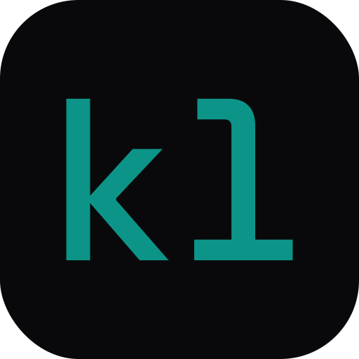

  

<h1 align="center">klar<em>labs</em></h1>

<strong>We build tools that make complex things clear.</strong>

Precision software from Munich — <a href="https://klarlabs.de">klarlabs.de</a>

---

## What we work on

**AI agent infrastructure** — memory, execution, and state for trustworthy agents

- [**mnemos**](https://github.com/klarlabs-studio/mnemos) — self-hosted memory + evidence layer for AI agents. Bitemporal recall, evidence-backed claims, no vendor cloud. ([Python](https://github.com/klarlabs-studio/mnemos-py) / [TypeScript](https://github.com/klarlabs-studio/mnemos-ts) wrappers)
- [**axi-go**](https://github.com/klarlabs-studio/axi-go) — safe, auditable execution kernel for agent tools. Approval gates, budgets, evidence trails.
- [**agent-go**](https://github.com/klarlabs-studio/agent-go) — state-driven agent runtime for Go. Trust through structural constraints.
- [**nomi**](https://github.com/klarlabs-studio/nomi) — local-first AI agent platform. Plan-review before execution, BYO LLM.
- [**scout**](https://github.com/klarlabs-studio/scout) — browser automation in one binary. Library, CLI, MCP server.
- [**mcp-go**](https://github.com/klarlabs-studio/mcp-go) — Go framework for building MCP servers.

**Resilience & observability** — production-grade plumbing for services that talk to LLMs

- [**fortify**](https://github.com/klarlabs-studio/fortify) — composable resilience patterns for Go: circuit breaker, retry, hedge, cost budget. Zero core deps. ([TypeScript](https://github.com/klarlabs-studio/fortify-ts))
- [**bolt**](https://github.com/klarlabs-studio/bolt) — Go logging that balances performance, DX, and observability.

**Developer tooling**

- [**coverctl**](https://github.com/klarlabs-studio/coverctl) — coverage feedback for AI coding agents, every language, via MCP and CLI.
- [**statekit**](https://github.com/klarlabs-studio/statekit) — Go-native statechart engine, XState JSON compatible.

---

Smart. Präzise. Wertig. Verlässlich.

